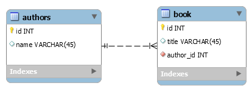

## About Library Management System

[Library Management System](http://library.basel-alebrahim.com/) is a software used to manages the catalogue of a library. This helps to keep the records of whole transactions of the books available in the library.

This system also involves maintaining the database for entering new books and recording books that have been borrowed with their respective due dates.

Here is a list of some features of Library Management System which our system offer:

- Add a book to the list
- Change book name.
- Delete a book from the list.
- Add an author to the list
- Change author name
- Delete an author with his books from the list
- Search for a book by book title or author name
- Sort by book title in ascending or descending
- Sort by author name in ascending or descending
- Export a list with author name and book title in CSV and XML
- Export a list with author name in CSV and XML
- Export a list with book title in CSV and XML

## Database Design

In systems analysis, a one-to-many relationship is a type of cardinality that refers to the relationship between two entities. In our application, we considered this type of relationship. In other words, a list of authors and their books describe books with only one author, in which case one row of the books table will refer to only one row of the authors table.

# ERD Diagram:

# Authors Table
| ID | Name       |
|:---|:-----------|
| 1  | Author 2.  |
| 2  | Author 2.  |

# Books Table
| ID | Title   | Author_id |
|:---|:--------|:----------|
| 1  | Book A  |     1     |
| 2  | Book B  |     2     |
| 3  | Book C  |     2     |

## Git Library Project online
1. Use [DigitalOcean](https://www.digitalocean.com/) as a Virtual Private Server
2. Use [forge.laravel.com](https://forge.laravel.com) to deploy our Project to my DigitalOcean 
3. Connect [Github Repository](https://github.com/Basel-Alebrahim/book.git) to Laravel Forge
4. Point the Domain to the [DigitalOcean](https://www.digitalocean.com/) Server with [GoDaddy](https://godaddy.com/)
